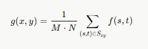
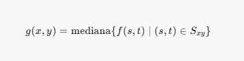
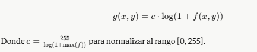
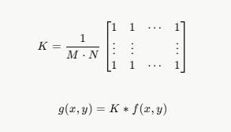
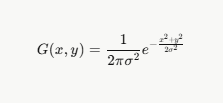
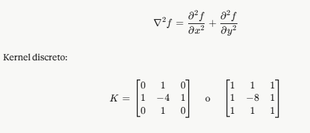
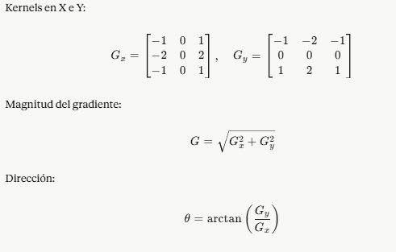
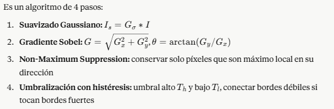

<div align="center">

#  Tarea 2 — Filtros de Imagen
### Procesamiento Digital de Imágenes


> **Fecha de entrega:** 06 de mayo de 2026

</div>

---

## 📋 Tabla de Contenidos

- [Descripción General](#-descripción-general)
- [Filtro 1 — Media](#-filtro-1--media)
- [Filtro 2 — Mediana](#-filtro-2--mediana)
- [Filtro 3 — Logarítmico](#-filtro-3--logarítmico)
- [Filtro 4 — Cuadro Normalizado](#-filtro-4--cuadro-normalizado-box-filter)
- [Filtro 5 — Gaussiano](#-filtro-5--gaussiano)
- [Filtro 6 — Laplaciano](#-filtro-6--laplaciano)
- [Filtro 7 — Sobel](#-filtro-7--sobel)
- [Filtro 8 — Canny](#-filtro-8--canny)

---

## 🧠 Descripción General

Este repositorio documenta e implementa en **Python + OpenCV** los 8 filtros de imagen clásicos correspondientes a la **Parte 1 de la Tarea 2** del curso de Procesamiento Digital de Imágenes. Cada filtro incluye su definición formal, fórmula matemática, ejemplo numérico paso a paso, explicación detallada y análisis de ventajas y desventajas.

---

---

## 🔵 Filtro 1 — Media

### ¿Qué es?

El filtro de media es uno de los filtros de suavizado más básicos y utilizados en el procesamiento de imágenes. Su principio consiste en **reemplazar el valor de cada píxel por el promedio aritmético** de todos los píxeles que conforman su vecindario, definido por una ventana de tamaño M×N. Al promediar los valores locales, se atenúan las variaciones bruscas de intensidad causadas por ruido aleatorio, resultando en una imagen más suave y homogénea. No distingue entre píxeles de ruido y bordes importantes, por lo que produce una pérdida de nitidez generalizada.

### 📐 Fórmula

<p align="center">
  
</p>

> Donde `f(s,t)` es el valor del píxel en la posición `(s,t)`, `M·N` es el número total de píxeles en el vecindario (ej. 3×3 = 9 píxeles) y `g(x,y)` es el píxel de salida resultante.

### 🔢 Ejemplo Numérico

Dado el siguiente vecindario 3×3 alrededor de un píxel central:

```
 [ 80   90  100 ]
 [ 85  [95] 105 ]
 [ 70   80   90 ]

Suma = 80 + 90 + 100 + 85 + 95 + 105 + 70 + 80 + 90 = 795

Media = 795 / 9 ≈ 88

✅ El píxel central (95) se reemplaza por 88
```

### 💡 Explicación

En términos prácticos, el filtro de media funciona como una **convolución de la imagen con un kernel uniforme** donde todos los coeficientes valen `1/(M×N)`. Esto implica que todos los píxeles del vecindario contribuyen de manera equitativa al resultado final, sin importar su distancia al píxel central. Es más efectivo contra el **ruido aditivo gaussiano** que contra el ruido impulsivo (sal y pimienta), ya que un solo píxel corrupto con valor extremo puede distorsionar significativamente el promedio del vecindario.

### ⚖️ Ventajas y Desventajas

| ✅ Ventajas | ❌ Desventajas |
|---|---|
| Simple y extremadamente rápido de calcular | Difumina bordes y detalles finos de la imagen |
| Reduce ruido gaussiano de forma efectiva | Muy sensible a valores atípicos (outliers) |
| Fácil de escalar cambiando el tamaño del kernel | Todos los píxeles tienen igual peso (poco natural) |
| Base conceptual para filtros más complejos | Puede generar artefactos en zonas de alta frecuencia |

---

## 🟢 Filtro 2 — Mediana

### ¿Qué es?

El filtro de mediana es un filtro **no lineal** diseñado específicamente para eliminar ruido impulsivo, conocido como ruido **"sal y pimienta"**. A diferencia del filtro de media, no calcula el promedio sino que **ordena todos los píxeles del vecindario** de menor a mayor intensidad y selecciona el valor que ocupa la posición central del ordenamiento. Los píxeles con valores extremos (0 o 255) quedan siempre desplazados hacia los extremos del vector ordenado, por lo que nunca pueden ocupar la posición central y son excluidos automáticamente del resultado.

### 📐 Fórmula

<p align="center">
  
</p>

> Para una ventana 3×3 (9 píxeles), la mediana es el **5.º valor** en el ordenamiento ascendente.

### 🔢 Ejemplo Numérico

```
Valores extraídos del vecindario 3×3:
  [80, 90, 100, 85, 95, 105, 70, 80, 90]

Ordenados de menor a mayor:
  [70, 80, 80, 85, →90←, 90, 95, 100, 105]
                    ↑
              Posición central (5/9)

✅ El píxel central (95) se reemplaza por 90

Caso con ruido sal (valor 255):
  [..., 255, ...] → el 255 queda en el extremo → NO afecta la mediana ✅
```

### 💡 Explicación

El filtro de mediana es particularmente efectivo porque los píxeles con valores extremos siempre quedan desplazados a los extremos del vector ordenado y nunca pueden ocupar la posición central. Adicionalmente, **preserva mucho mejor los bordes** que el filtro de media, ya que no mezcla las intensidades de ambos lados de un borde; en cambio, elige el valor que corresponde al lado mayoritario del vecindario. Su principal desventaja es el mayor costo computacional, ya que requiere ordenar los píxeles del vecindario para cada posición de la imagen.

### ⚖️ Ventajas y Desventajas

| ✅ Ventajas | ❌ Desventajas |
|---|---|
| Excelente contra ruido sal y pimienta | Mayor costo computacional (requiere ordenamiento) |
| Preserva bordes mucho mejor que la media | Puede suavizar texturas finas o detalles pequeños |
| Inmune a valores atípicos extremos | Menos efectivo contra ruido gaussiano puro |
| No introduce valores nuevos en la imagen | Para ventanas grandes puede generar efecto "pintura" |

---

## 🟡 Filtro 3 — Logarítmico

### ¿Qué es?

El filtro logarítmico es una **transformación de punto** (point operation) que aplica una función logarítmica a cada píxel de la imagen de forma individual, sin considerar su vecindario. Su objetivo principal es **comprimir el rango dinámico**: expande los valores oscuros (bajas intensidades) hacia rangos más altos y comprime los valores brillantes (altas intensidades). Esto mejora notablemente el contraste en zonas subexpuestas y es especialmente útil en imágenes médicas, astronómicas o espectrales con rangos de intensidad muy amplios.

### 📐 Fórmula

<p align="center">
  
</p>

> Se suma `1` para evitar `log(0)`. La constante `c` normaliza el resultado al rango `[0, 255]`.

### 🔢 Ejemplo Numérico

```
Imagen 8 bits → max(f) = 255
c = 255 / log(1 + 255) = 255 / log(256) ≈ 255 / 2.408 ≈ 45.9

Píxel oscuro     f = 10  →  g = 45.9 × log(11)  ≈  47.8
Píxel medio      f = 100 →  g = 45.9 × log(101) ≈  92.0
Píxel brillante  f = 200 →  g = 45.9 × log(201) ≈ 105.7

✅ El rango [10..200] se comprime a [48..106] en la salida
✅ Las zonas oscuras ganan más espacio relativo en la escala de salida
```

### 💡 Explicación

La transformación logarítmica es útil cuando la mayor parte de la información visual está concentrada en las zonas oscuras. La función logarítmica crece rápido para valores pequeños y lentamente para valores grandes, lo que naturalmente realza los detalles en las sombras sin saturar las luces. Una variante es la **transformación exponencial** (log inverso), que comprime sombras y expande luces. La constante `c` puede ajustarse para controlar la agresividad de la transformación.

### ⚖️ Ventajas y Desventajas

| ✅ Ventajas | ❌ Desventajas |
|---|---|
| Mejora visibilidad en regiones oscuras | Puede saturar o perder detalle en zonas brillantes |
| Ideal para imágenes con alto rango dinámico | No elimina ruido; solo redistribuye el contraste |
| Operación pixel a pixel: extremadamente rápida | La constante `c` requiere ajuste según la imagen |
| Útil en imágenes médicas, astronómicas y espectrales | Introduce distorsión no lineal en la escala de grises |

---

## 🟠 Filtro 4 — Cuadro Normalizado (Box Filter)

### ¿Qué es?

El filtro de cuadro normalizado (Box Filter) es la implementación del filtro de media expresada como una **convolución con un kernel uniforme**. Todos los coeficientes del kernel tienen exactamente el mismo valor: `1/(M×N)`. Su ventaja clave es que puede implementarse mediante **imágenes integrales (summed area tables)**, lo que permite calcular el resultado en tiempo **O(1) por píxel** independientemente del tamaño del kernel. OpenCV lo implementa directamente con `cv2.boxFilter()`.

### 📐 Fórmula

<p align="center">
  
</p>

> El operador `*` denota convolución 2D. `K` es el kernel M×N con todos sus coeficientes iguales a `1/(M×N)`.

### 🔢 Ejemplo Numérico

```
Kernel 3×3 normalizado:

       1   [ 1  1  1 ]
  K = ─── × [ 1  1  1 ]
       9   [ 1  1  1 ]

Aplicado sobre [80,90,100; 85,95,105; 70,80,90]:
  g = (1/9)(80+90+100+85+95+105+70+80+90) = 795/9 ≈ 88

OpenCV:
  cv2.boxFilter(img, -1, (3,3), normalize=True)   # promedio
  cv2.boxFilter(img, -1, (3,3), normalize=False)  # suma simple
```

### 💡 Explicación

La ventaja principal del box filter es su implementación mediante **imágenes integrales**: una imagen integral `I(x,y)` almacena la suma acumulada de todos los píxeles desde la esquina superior izquierda hasta `(x,y)`. Con esta estructura, la suma de cualquier región rectangular se calcula con exactamente **4 operaciones aritméticas**, sin importar el tamaño de la región. Esto lo hace muy eficiente para aplicaciones en tiempo real, como seguimiento de objetos o detección de características a múltiples escalas.

### ⚖️ Ventajas y Desventajas

| ✅ Ventajas | ❌ Desventajas |
|---|---|
| Implementación O(1) con imágenes integrales | Borra bordes y detalles finos igual que la media |
| Escalable: el costo no crece con el tamaño del kernel | Todos los píxeles tienen el mismo peso (no isotrópico) |
| Muy eficiente para aplicaciones en tiempo real | Poco efectivo contra ruido impulsivo |
| Base para algoritmos como SURF y tracking | Puede producir halos en bordes de alto contraste |

---

## 🟣 Filtro 5 — Gaussiano

### ¿Qué es?

El filtro gaussiano es el **filtro de suavizado más utilizado** en visión por computador y la base de algoritmos como Canny, SIFT y LoG. A diferencia del box filter donde todos los píxeles tienen igual peso, el filtro gaussiano asigna pesos que siguen la forma de una **campana de Gauss**: los píxeles más cercanos al centro tienen mayor influencia y los pesos decrecen suavemente con la distancia. Es el único filtro lineal de suavizado completamente **isotrópico** (sin dirección preferida). El parámetro **σ** controla el nivel de suavizado.

### 📐 Fórmula

<p align="center">
  
</p>

> `(x,y)` son coordenadas relativas al centro del kernel. A mayor `σ`, mayor difuminado. El kernel se trunca normalmente a un tamaño de `6σ × 6σ` píxeles.

### 🔢 Ejemplo Numérico

```
Kernel gaussiano 3×3 aproximado (σ ≈ 1.0):

       1   [ 1  2  1 ]
  K = ─── × [ 2  4  2 ]
      16   [ 1  2  1 ]

Pesos:
  Centro           = 4/16 = 0.2500
  Vecinos directos = 2/16 = 0.1250
  Esquinas         = 1/16 = 0.0625

→ El píxel central pesa 4× más que las esquinas ✅

OpenCV:
  cv2.GaussianBlur(img, (5,5), sigmaX=1.0)  # σ=1.0
  cv2.GaussianBlur(img, (9,9), sigmaX=2.0)  # σ=2.0 → más desenfoque
```

### 💡 Explicación

Una propiedad fundamental del filtro gaussiano es que es **separable**: el kernel 2D puede descomponerse en el producto de dos kernels 1D (uno horizontal y uno vertical), reduciendo la complejidad de O(k²) a O(2k) por píxel. Además, el gaussiano es el único filtro que no introduce nuevas frecuencias espaciales en la imagen, lo que lo hace ideal como **paso previo para detectores de bordes** como Canny o el filtro LoG (Laplacian of Gaussian).

### ⚖️ Ventajas y Desventajas

| ✅ Ventajas | ❌ Desventajas |
|---|---|
| Suavizado isotrópico y natural | Difumina bordes (aunque menos que la media) |
| Separable: menor costo computacional | `σ` debe elegirse cuidadosamente según la tarea |
| Excelente para eliminar ruido gaussiano | Más costoso que el box filter |
| Base de Canny, SIFT, LoG y Scale-Space | No efectivo contra ruido impulsivo de alta amplitud |

---

## 🔴 Filtro 6 — Laplaciano

### ¿Qué es?

El filtro Laplaciano es un operador diferencial de **segundo orden** que amplifica las altas frecuencias de la imagen (bordes, esquinas, detalles finos). Calcula la segunda derivada de la función de intensidad, lo que lo hace sensible a cualquier discontinuidad de intensidad **sin importar su orientación**: es un detector de bordes omnidireccional. Por ser extremadamente sensible al ruido, casi siempre se aplica después de un suavizado gaussiano previo, combinación conocida como **LoG (Laplacian of Gaussian)** o filtro Mexican Hat.

### 📐 Fórmula

<p align="center">
  
</p>

> La segunda derivada discreta se aproxima restando el valor central multiplicado por 4 (u 8 en la versión extendida) de la suma de sus vecinos. El resultado es alto en bordes y cercano a cero en zonas uniformes.

### 🔢 Ejemplo Numérico

```
Kernels discretos del Laplaciano:

  Estándar (4-conectado):      Extendido (8-conectado):
  K1 = [  0   1   0 ]          K2 = [  1   1   1 ]
        [  1  -4   1 ]                [  1  -8   1 ]
        [  0   1   0 ]                [  1   1   1 ]

Ejemplo en fila: [100, 100, 100, 200, 200, 200]
En la posición del borde (idx=3):
  ∇²f ≈ f(2) − 2·f(3) + f(4) = 100 − 400 + 200 = −100

✅ Valor alto en módulo → BORDE detectado

OpenCV:
  dst = cv2.Laplacian(img, cv2.CV_64F)
  dst = np.uint8(np.absolute(dst))
```

### 💡 Explicación

El Laplaciano produce respuestas tanto positivas como negativas alrededor de un borde, por lo que la imagen resultante debe convertirse a un tipo de dato con signo antes de visualizarla. Una técnica común es el **realce de bordes (sharpening)**: sumar el Laplaciano a la imagen original `g = f - ∇²f` amplifica los detalles sin modificar las zonas planas. El operador también identifica los **puntos de cruce por cero (zero-crossings)**, que marcan con precisión la ubicación de los bordes.

### ⚖️ Ventajas y Desventajas

| ✅ Ventajas | ❌ Desventajas |
|---|---|
| Detecta bordes en todas las direcciones | Extremadamente sensible al ruido |
| Útil para realce de bordes (sharpening) | Produce bordes dobles (respuesta bipolar) |
| Identifica puntos de cruce por cero (zero-crossings) | No proporciona información de dirección del borde |
| Sencillo de implementar con kernels discretos | Requiere suavizado previo (LoG) para uso práctico |

---

## 🔶 Filtro 7 — Sobel

### ¿Qué es?

El filtro Sobel calcula la **primera derivada** de la imagen en las direcciones horizontal y vertical usando kernels que combinan diferenciación y suavizado gaussiano integrado. Esta combinación lo hace más robusto al ruido que el Laplaciano. Entrega tanto la **magnitud del gradiente** (qué tan intenso es el borde) como su **dirección angular** (orientación perpendicular al borde), información fundamental para el algoritmo de Canny y para la construcción del descriptor HOG.

### 📐 Fórmula

<p align="center">
  
</p>

> `Gx` detecta bordes verticales. `Gy` detecta bordes horizontales. `G` es la magnitud del gradiente y `θ` es la dirección perpendicular al borde.

### 🔢 Ejemplo Numérico

```
Kernels de Sobel:
  Gx = [ -1   0  +1 ]     Gy = [ -1  -2  -1 ]
        [ -2   0  +2 ]           [  0   0   0 ]
        [ -1   0  +1 ]           [ +1  +2  +1 ]

Parche 3×3:
  [  10   10   10  ]
  [  10   10  200  ]
  [  10   10  200  ]

Gx_centro ≈ (200+400+200) − (10+20+10) = 800 − 40 = 760
→ Gradiente horizontal muy alto → BORDE VERTICAL detectado ✅

G = √(Gx² + Gy²)  → magnitud alta en el borde
θ = arctan(Gy/Gx) → dirección perpendicular al borde

OpenCV:
  Gx = cv2.Sobel(img, cv2.CV_64F, 1, 0, ksize=3)
  Gy = cv2.Sobel(img, cv2.CV_64F, 0, 1, ksize=3)
  G  = cv2.magnitude(Gx, Gy)
```

### 💡 Explicación

El filtro Sobel puede entenderse como la convolución de la imagen con un kernel diferencial `[-1, 0, 1]` combinado con un kernel de suavizado `[1, 2, 1]`. Los pesos centrales de `2` dan **mayor importancia a los píxeles más cercanos** al borde detectado, lo que lo distingue del operador de Prewitt (que usa `[1,1,1]`) y le otorga mayor robustez frente al ruido. El operador puede extenderse a kernels más grandes (5×5, 7×7) para mayor suavizado y precisión en la localización de bordes.

### ⚖️ Ventajas y Desventajas

| ✅ Ventajas | ❌ Desventajas |
|---|---|
| Calcula magnitud Y dirección del gradiente | Produce bordes gruesos (más de 1 px de ancho) |
| Más robusto al ruido que el Laplaciano | Puede perder bordes diagonales de alta frecuencia |
| Kernels separables: eficiente computacionalmente | Respuesta no completamente isotrópica |
| Ampliamente soportado en todas las librerías | Sensible a ruido residual |

---

## ⚡ Filtro 8 — Canny

### ¿Qué es?

El detector de bordes Canny (John Canny, 1986) es considerado el **detector de bordes óptimo** bajo tres criterios formales: buena detección (mínimos falsos positivos y negativos), buena localización (bordes detectados cerca de los reales) y respuesta única (un solo punto de respuesta por cada borde real). Combina cuatro etapas de procesamiento para producir bordes **delgados, limpios y bien conectados**. Es el estándar de la industria para detección de bordes en visión por computador.

### 📐 Fórmula / Algoritmo

<p align="center">
  
</p>

> Canny no es un kernel único sino un pipeline de 4 etapas: Suavizado Gaussiano → Gradiente Sobel → Non-Maximum Suppression → Umbralización con Histéresis.

### 🔢 Proceso Completo

```
─────────────────────────────────────────────────────────────
ETAPA 1 — Suavizado Gaussiano  (σ típico: 1.0 – 1.4)
─────────────────────────────────────────────────────────────
  I_s = GaussianBlur(I, σ)
  → Elimina ruido antes de calcular derivadas

─────────────────────────────────────────────────────────────
ETAPA 2 — Gradiente Sobel
─────────────────────────────────────────────────────────────
  G = √(Gx² + Gy²)     θ = arctan(Gy/Gx)

─────────────────────────────────────────────────────────────
ETAPA 3 — Non-Maximum Suppression (NMS)
─────────────────────────────────────────────────────────────
  Para cada píxel:
    Si G(x,y) NO es máximo local en la dirección θ → G(x,y) = 0
  → Adelgaza bordes gruesos a bordes de exactamente 1 píxel ✅

─────────────────────────────────────────────────────────────
ETAPA 4 — Umbralización con Histéresis  (Th=200, Tl=100)
─────────────────────────────────────────────────────────────
  G > 200          → Borde FUERTE   → aceptado definitivamente
  100 < G < 200    → Borde DÉBIL    → solo si conecta con borde fuerte
  G < 100          → Descartado

✅ Conecta bordes fragmentados sin incluir ruido

OpenCV:
  cv2.Canny(img, threshold1=100, threshold2=200)
```

### 💡 Explicación

La etapa más distintiva de Canny es el **Non-Maximum Suppression**: para cada píxel se examina si su magnitud de gradiente es un máximo local en la dirección `θ`. Si no lo es, se suprime, adelgazando los bordes gruesos del Sobel a bordes de exactamente un píxel. La **umbralización por histéresis** usa dos umbrales: los píxeles con gradiente mayor a `Th` son bordes seguros; los que están entre `Tl` y `Th` son bordes débiles que solo se conservan si están conectados a un borde fuerte. El resultado son bordes nítidos, delgados y topológicamente coherentes.

### ⚖️ Ventajas y Desventajas

| ✅ Ventajas | ❌ Desventajas |
|---|---|
| Bordes delgados de exactamente 1 píxel | Más lento que Sobel y Laplaciano |
| Robusto al ruido gracias al suavizado previo | Requiere ajuste de dos umbrales (`Tl`, `Th`) |
| Conecta bordes fragmentados con histéresis | Puede perder bordes débiles legítimos con `Tl` alto |
| Óptimo bajo criterios matemáticos formales | El suavizado puede borrar bordes muy finos |

---

<div align="center">

**Procesamiento Digital de Imágenes · 2026**

</div>